# teamtalk架构分析
---

### IM系统特点

1. 实时性：保证消息实时触达（利用轮训与长连接实现，消息提示推送与阅读消息对应操作是不同的）
2. 可靠性：保证消息不丢失和不重复（ACK机制，TCP只能保证消息数据链路层可靠，不能保证业务可靠）
3. 一致性：保证同一条消息在多人、多终端展现顺序的一致性（消息序号生成器）
4. 安全性：保证数据传输安全、数据存储安全、消息内容安全（WWS、HTTPS、TLS、AES等）

### 系统架构

1. Android/IOS/PC各种客户端
2. LoginServer：主要负责负载均衡的作用，当收到客户端请求时，分配一个负载最小的MsgServer给客户端
3. MsgServer：主要服务端，负责维护各个客户端的连接，消息转发等功能
4. RouteServer：负责消息路由功能，当MsgServer发现某个用户不在本服务器内而又有消息需要发给他时，就会将消息发给routeServer，而给routeServer会将消息发给相应的MsgServer（routeServer也维护了一定的用户状态）
5. DBProxy：负责主要业务逻辑，主要与存储层打交道，提供mysql以及redis的访问服务，屏蔽其他服务器与mysql和redis的直接交互
6. FileServer：文件服务器，提供客户端之间的文件传输服务，支持在线以及离线文件传输
7. MsfsServer：图片存储服务器，提供头像、图片传输中的图片存储服务
8. PushServer：负责Android、IOS客户端提醒消息的推送，类似微信的锁屏提醒消息。
9. WebServer：简单的管理功能

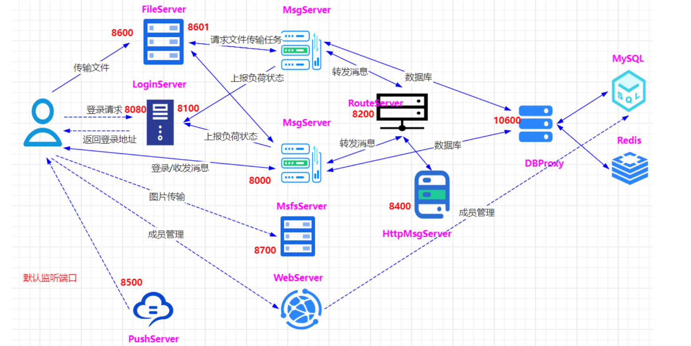

#### 1.登录验证

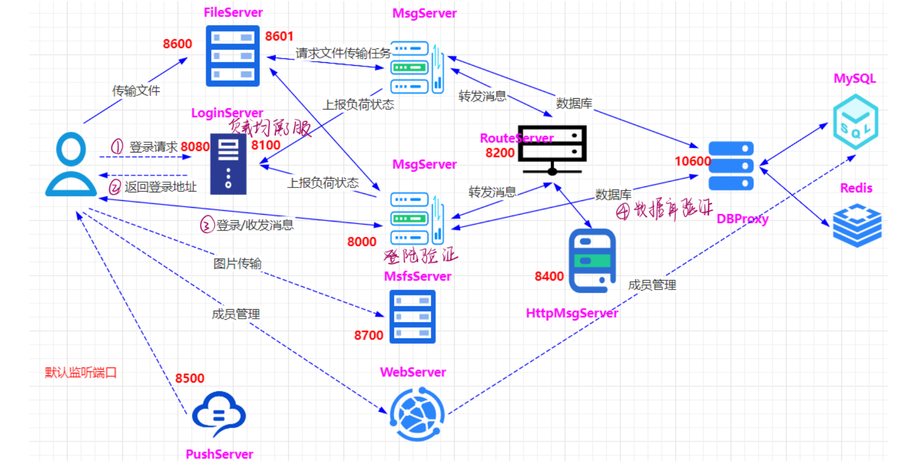

#### 2.消息发送

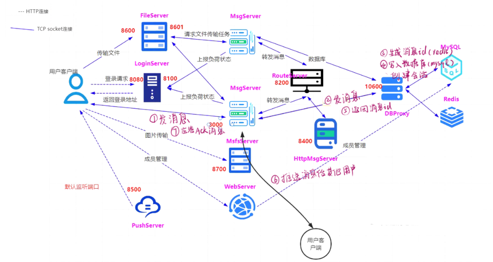

### 即时通讯分层架构

1. 连接层entry/gate：为客户端收发消息提供出入口，主要作用包括：

    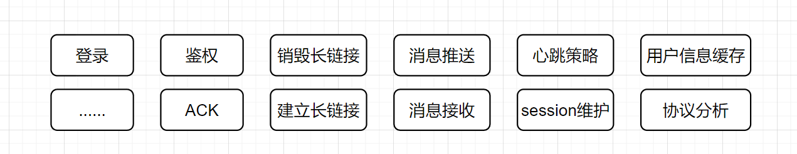

    - 保持海量用户连接，

    - 解析协议对传输内容进行编码，

    - 维护session

    - 推送消息

2. 核心业务层logic：负责IM系统各项功能的核心逻辑实现

    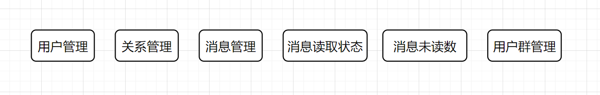

3. 路由层route：负责消息投递

    

4. 数据层data：负责IM系统相关数据的持久化存储，包括消息内容、账号信息等

    

5. 外部接口层：常用的第三方系统推送服务，苹果手机自带的APNs服务、安卓手机内置的谷歌公司GCM服务等

    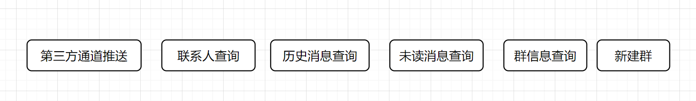

6. 基础组件：

    

#### 1.接入层

##### （1）连接整流与通信安全：

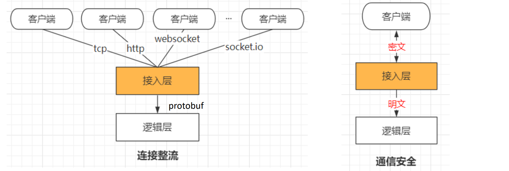

##### （2）报文解压缩与初步防攻击：

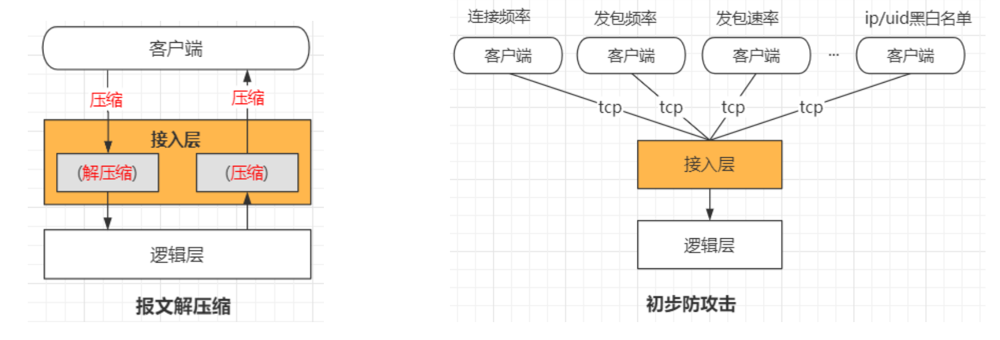

#### 2.逻辑层

1. 用户逻辑：用户登录、用户退出、用户信息查询、用户更新签名、用户分组创建
2. 好友逻辑：添加好友、删除好友、拉取好友列表、好友添加备注等
3. 群组逻辑：创建群、加入群、删除群、删除群成员等
4. 消息逻辑：单聊文字消息、单聊语音消息、群聊文字消息、群聊语音消息、拉取离线消息等
5. 其他：文件传输（需要对方点击接受）、图片传输（直接显示）

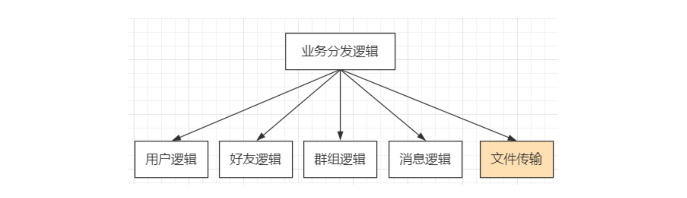

水平扩展各个逻辑模块、消息逻辑1、消息逻辑2、消息逻辑n，无缝添加新的逻辑服务如文件传输。

#### 3.数据代理层

##### （1）屏蔽存储引擎：

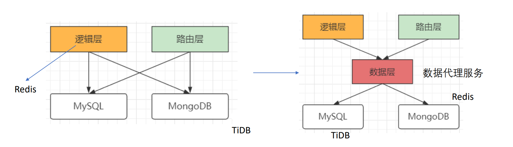

##### （2）屏蔽cache层：

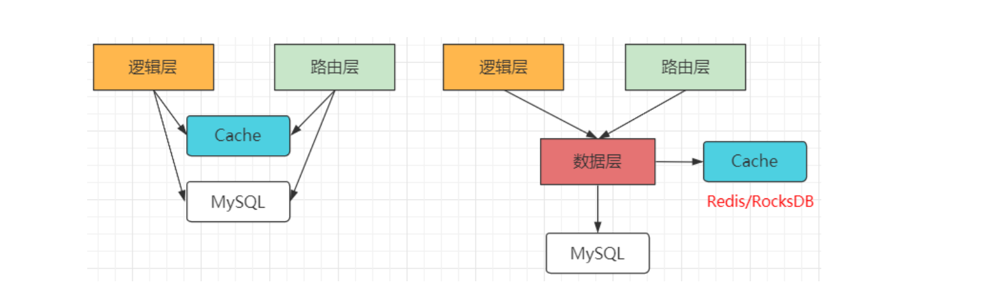

##### （3）提供友好接口：

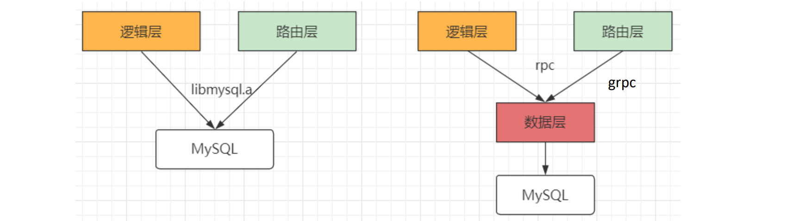

##### （4）提供一定扩展性：

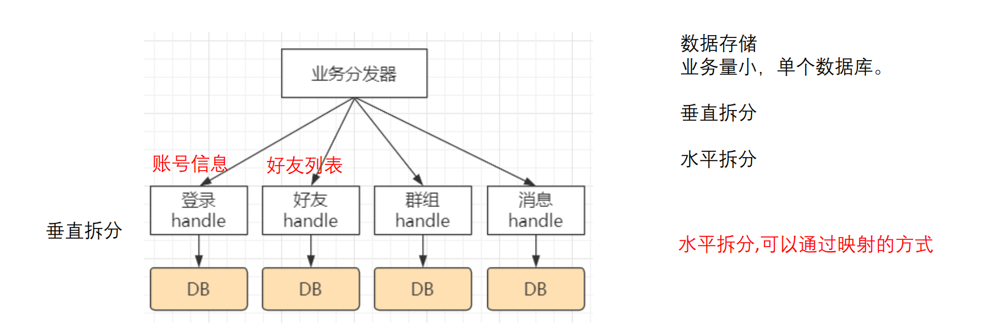

#### 4.路由层

消息投递，内存存储，用户临时数据比如用户状态信息（在线/离线等）

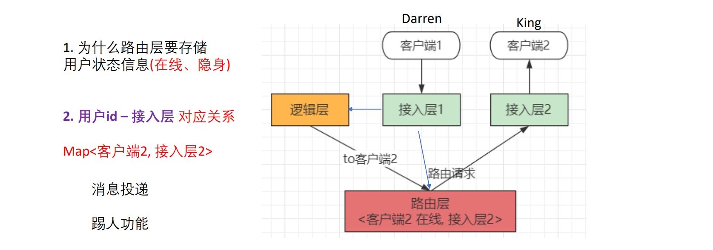

